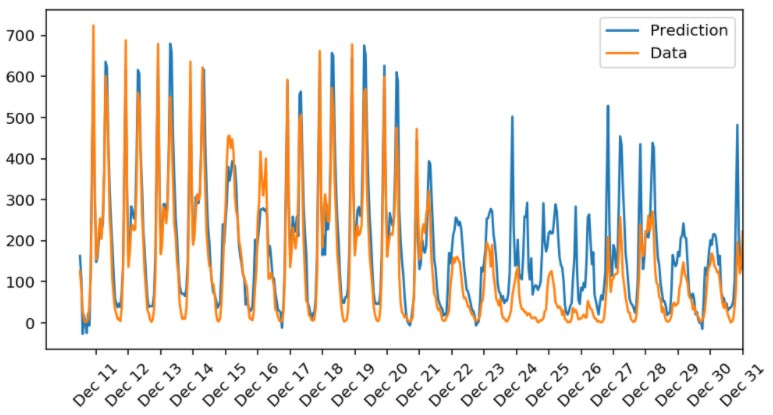

# Predicting-Bike-Sharing-Patterns

In this project, a simple neural network is built and used to predict daily bike rental ridership.




# Project Instructions

1. Clone the repository and navigate to the downloaded folder.

2. Make sure you have already installed the necessary Python packages according to the requirements.txt in the repository.

3. Open a terminal window and navigate to the project folder. Open the notebook using:
```
	jupyter notebook Your_first_neural_network.ipynb
```
